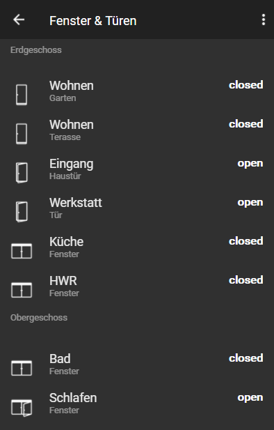

# ioBroker.vis-material
============

  

material - Material widgets for ioBroker.vis.

You can read instructions in material.js, material.html files

These widgets are in addition to the material design style of Uhula, which you can find here:
https://github.com/Uhula/ioBroker-Material-Design-Style

## Changelog

### 0.2.0
- (EdgarM73) widgets are now customizable, text-color, icon, color of overlay

### 0.1.8
- (EdgarM73) renamed css classes due to incompatibility with Uhula Material Design Schema

### 0.1.7
- (EdgarM73) dark material button alike

### 0.1.6 (2020-07-12)
- (EdgarM73) feat: new Occupancy widget

### 0.1.5 (2018-07-11)
- (pix) feat: new window shutter widget

### 0.1.4 (2018-07-10)
- (pix) feat: new humidity widget

### 0.1.3 (2018-01-21)
- (nisio) feat: new dimmer widget

### 0.1.2 (2018-01-20)
- (nisio) feat: switch added to light widget

### 0.1.1 (2018-01-14)
- (nisio) feat: temperature and light widget

### 0.1.0 (2018-01-13)
- (nisio) Initial version for public testing (includes css from material design styles V1.8)

### 0.0.1 (2018-01-01)
- (nisio) Initial version for internal testing

## License
 Copyright (c) 2018-2018 nisiode
 MIT
